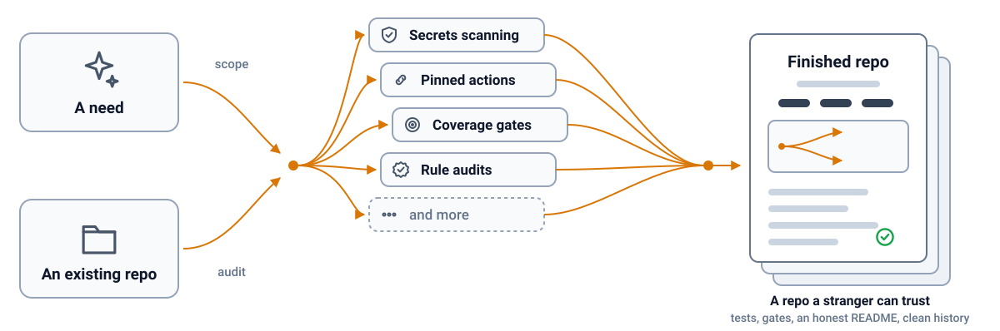

<h1 align="center">🧩 ossemble</h1>

  <b>Assembles a finished, trustworthy open source repo from a need or an existing one.</b>

  
  
  
  
  
  

  

## Features

ossemble takes a scope with nothing built yet, or a repo that already exists, and works it through the same gates either way.

- 🚧 **Gates from day zero.** Secrets scanning, pinned actions and a coverage floor start at boot, not at the end.
- 📋 **Rules as data.** Every rule carries a basis: a measured fact, an incident or a named source.
- 🔍 **Audit by rule id.** Prints exactly which rule failed, where and why, sorted and machine readable.
- 🧵 **Parallel builders.** Work splits across an ownership map, so builders never touch the same file.
- ⏸️ **Resumable across sittings.** Reads the stage, any regression and the next step back from the repo itself.
- ✅ **Recommendations with a verdict.** Every optional part gets a do-it-or-skip-it answer before the cost and the catch.
- 📣 **Listing for discovery.** Registers a finished repo on the channels that fit its shape.
- 🛠️ **Your rules, your tools.** The rule set and the tool table are data you edit, not code you fork.

## In action

[`tests/eval/consumers.py`](tests/eval/consumers.py) clones thirteen pinned public repos and checks the rows it prints against [`tests/eval/consumers.json`](tests/eval/consumers.json), the stored answer key, so a probe that starts or stops flagging something real shows up as a diff. Against [actions/checkout](https://github.com/actions/checkout), the audit finds twelve real gaps, from an unpinned action reference to a Dependabot config with no weekly cooldown.

## Fit

Use it when:

- Starting a new open source skill, agent, action or library and want tests, gates and an honest README from day one.
- Hardening or finishing a Python repo that already exists, with an audit sorted by rule id.
- Running several builders in parallel who must never edit the same file.

Look elsewhere when:

- The target repo is not a Python project, since the boot and finish templates assume `pyproject.toml` and ruff.
- The work needs to publish a package or tag a release on its own, since ossemble never does either without a go.
- A stranger's trust in the finished repo does not matter to you.

Add ossemble as a skill with the skills CLI. Its path is `oficiallyAkshay/ossemble`.

## How it compares

| | [oficiallyAkshay/ossemble](https://github.com/oficiallyAkshay/ossemble) | [AnayDhawan/oss-launch](https://github.com/AnayDhawan/oss-launch) | [zeyuzhangzyz/open-source-hardening-skills](https://github.com/zeyuzhangzyz/open-source-hardening-skills) | [obra/superpowers](https://github.com/obra/superpowers) |
| --- | --- | --- | --- | --- |
| Shape | skill | skill | skill | skill |
| Gates from day zero | ✅ | ❌ | ❌ | unknown |
| Rules as data | ✅ | ✅ | ❌ | unknown |
| Audit by rule id | ✅ | ❌ | ❌ | unknown |
| Parallel builders | ✅ | ❌ | ❌ | ✅ |
| Resumable | ✅ | ❌ | ❌ | ❌ |
| Recommendations | ✅ | ✅ | ✅ | unknown |
| Hardening review | ✅ | ✅ | ✅ | ❌ |
| Auto-merge on open | ✅ | unknown | ❌ | ❌ |

## Security and limits

The credential is `GITHUB_TOKEN`. It is each workflow's own built-in copy, read-only wherever GitHub allows it, and the skill itself uses no token unless the owner opts in.

- ❌ publishes a package
- ❌ tags a release
- ❌ installs an app
- ❌ changes a repository setting
- ❌ flips visibility
- ❌ sends telemetry
- ❌ stores a token
- ❌ rewrites history

By default the coverage gate ramps, 70 while building, 100 at finish, and never drops. By default the owner signs off before boot, on each recommendation, and on the flip to public. It needs git, gh and uv on PATH, and Python 3.11 or newer, and the script itself depends on nothing beyond the standard library. A private repository gets every check, and staying private is a legitimate outcome several recommendations hang on.
